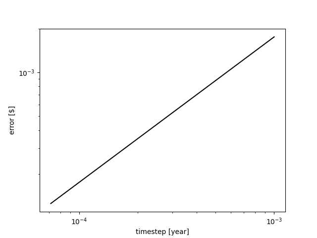
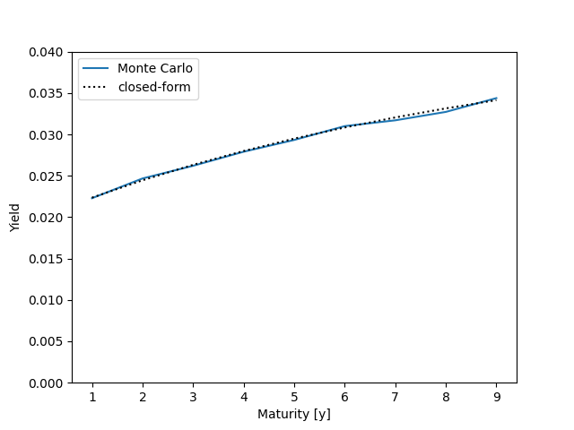

# Quantitative Finance Package

## Introduction

This repo contains some example of quantitative finance topics based on what I 
learned at EPFL during the Master in Financial Engineering (MFE).

## Observations

In my opinion, Python is not the best language to use for a big quantitative 
finance repository. Not being statically typed makes this language more
difficult to debug and more prone do runtime errors, when the codebase becomes 
very large and many people start working on the same code.

Despite these limitations, the static checker Mypy does a good job in preventing
many errors that might arise during runtime. I have to note that Mypy has some 
bugs, but there are some easy workarounds.

The advantage of Python is the huge amount of free libraries that can be used.

## CI pipeline

Every time `git push` is executed, a static type check is performed using 
**mypy**. Also **unit testing** is performed.

## CD pipeline

In the future I would like to develop a CD pipeline to deploy and run the model
on a server.

## Multiprocessing

Note that **multiprocessing** module is used to make full use of multi-core 
CPUs.

## Testing

I also created a directory for unit testing of the code.

## Risk Management

This section has yet to be started.

## Option pricing

With `plot_approx_error_european_option.py` script I want to show that binomial
tree approximation of European options price has an approximation error which is
**O(dt)**, with **dt** being the timestep.

## Interest rate

With `plot_yield_curve.py` script I want to show how the exact formula for the 
yield curve using Vasicek short-rate model can be approximated by using Monte 
Carlo. The Monte Carlo simulation makes use of "multiprocessing" package. Every 
simulation is run in a separated process.

