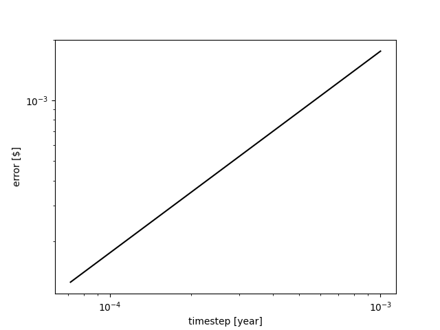
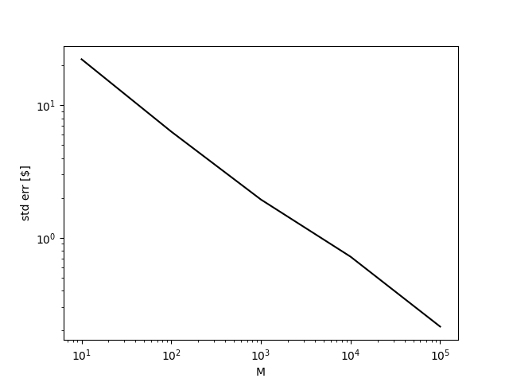
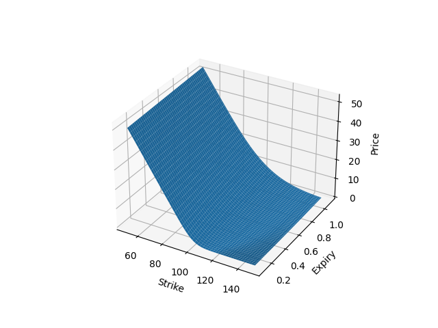
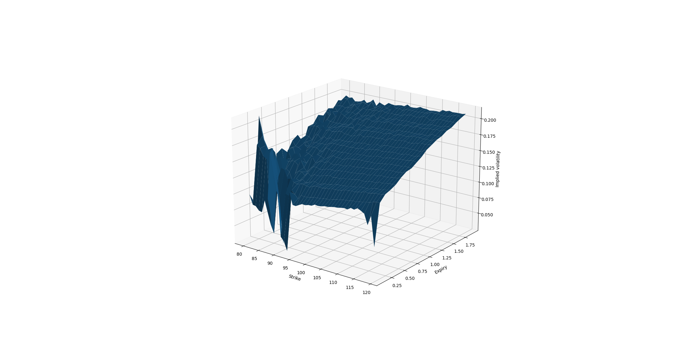
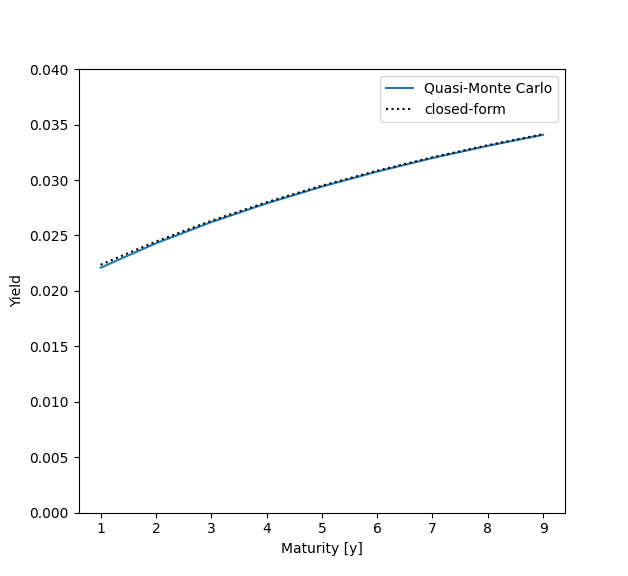

# Quantitative Finance Package

## Introduction

This repo contains some examples of quantitative finance topics, based on what I 
learned at EPFL during the Master in Financial Engineering (MFE).

## Observations

Python is not the best language for a big quantitative finance repository, 
because it is not statically typed. That makes the the code difficult to debug
and more prone to runtime errors, without prior compilation. The issue becomes 
more evident when the code base becomes very large and many people start working
on it.

Despite these limitations, the Mypy static checker does a good job in preventing
many errors that might arise during runtime. That said, Mypy has some 
bugs.

The big advantage of Python is the huge amount of free libraries that can be 
used.

## CI/CD

### CI pipeline

Every time `git push` is executed, a static type check is performed using 
**mypy**. Also, **unit testing** is performed.

### CD pipeline

In the future I would like to develop a CD pipeline to deploy and run the model
on a server.

## Docker

We can create a Docker image of the project. Then we can run the Docker 
containers to test the code in an isolated environment, separated from the 
local machine.

## Multiprocessing

**multiprocessing** module is used to make full use of multi-core 
CPUs. The fact that Python is not multithreaded due to GIL is a limitation to
take into account. Memory cannot be easily shared between processes, while it 
can be easily done with threads.

## Testing

Unit testing let developers be more confident when they make changes in
the code, since new bugs can be easily spot.

## Risk Management

This section has yet to be started.

## Option pricing

### Binomial method

With `plot_approx_error_european_option.py` script I want to show that the 
binomial tree approximation of European options price has an approximation error 
which is **O(dt)**, with **dt** being the timestep used in the binomial tree.

### Monte Carlo method

`plot_mc_approx_error_european_option.py` script shows how the standard error is **O(1/sqrt(M))**
with M the number of iterations in the Monte Carlo simulation.

The images above also show that binomial pricing methos is computationally more efficient 
compared to Monte Carlo method when pricing European options.

### American call option price surface

Below is the price surface obtained for American call options with different
strike and expiries using `plot_price_surface.py` script.

## Implied volatility

This section is still on going. The goal is to plot a simulation of the volatility surface.

Currently, I implemented Monte Carlo pricing of European call options using the Heston model.
The Heston model considers the volatility of the underlying not as a constant but as a random process.
In particular the variance (or square of volatility) follows a CIR process.

To obtain the implied volatility, first I price a European call option using the Heston model of volatility
with Monte Carlo simulation. Then the implied volatilty is obtained by inverting the Black-Scholes formula.

Below is the volatility surface I obtained. Note that the simulation become very unstable when the 
moneyness increases (strike low) and expiry is close to zero.

## Interest rate

With `plot_yield_curve.py` script I want to show how the exact formula for the 
yield curve using Vasicek short-rate model can be approximated by using Monte 
Carlo. The Monte Carlo simulation makes use of "multiprocessing" package. 
Indeed, every simulation is run in a separate process.

